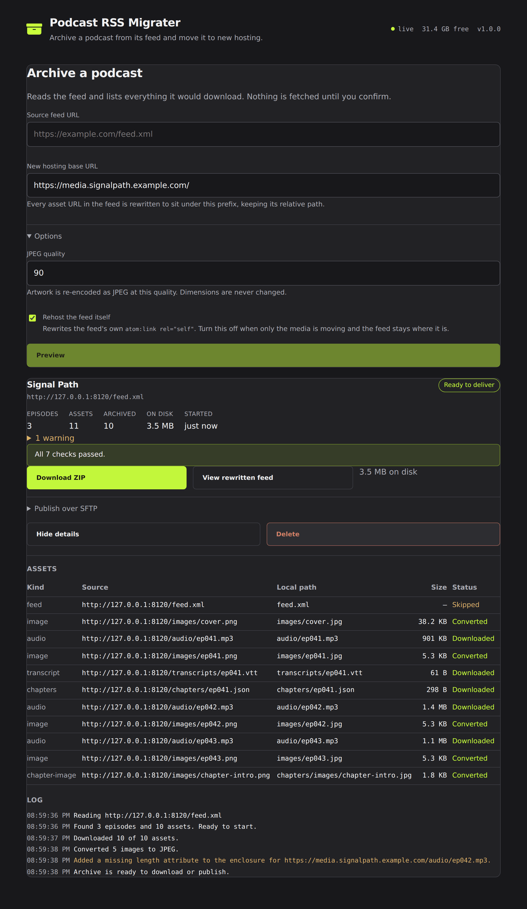

# Podcast RSS Migrater

A free, open-source, self-hosted web app that archives a podcast from its RSS feed and moves it to
new hosting. Give it a feed URL and the base URL of your new host: it downloads every episode,
transcript, chapter file and piece of artwork, converts the artwork to JPEG, rewrites every asset URL
in the feed to point at the new location, and hands the result back as a ZIP or pushes it straight to
your web host over SFTP.

```
Podcast RSS Migrater                                                      v1.0.0
Archive a podcast from its feed and move it to new hosting.
```

## Overview

Moving a podcast between hosts means moving the media *and* rewriting the feed that points at it, and
getting the second part wrong breaks every subscriber. This does both in one pass and then tells you
what it checked: that the rewritten feed still parses, that every episode GUID is untouched, that
every migrated URL resolves to a file actually present in the archive, and that nothing is still
pointing at the host you are leaving.

No accounts, no cloud services, no telemetry and no tracking. Archives live in a directory you chose,
and SFTP credentials are used for the transfer you asked for and then discarded — they are never
written to disk.

This replaces an earlier Python CLI (`migrate_podcast.py`) that post-processed a backup folder some
other tool had already produced. The archiving step is now part of the app, so there is nothing to
prepare first.

## Screenshot



## Features

- **Archive from a feed URL** — discovers and downloads audio enclosures, episode and channel
  artwork, `podcast:transcript` files, `podcast:chapters` documents and the images those chapters
  reference.
- **Preview before committing** — reading the feed is a separate step from downloading it. You see
  the episode count, every asset and its derived local path before anything is fetched, which
  matters when a back catalogue runs to tens of gigabytes.
- **Artwork converted to JPEG** — EXIF orientation baked into the pixels, transparency composited
  onto white, EXIF/ICC/DPI carried across, and **no resizing**. Every output is reopened and decoded
  to prove it is a valid JPEG before the original is discarded.
- **URL rewriting that reaches into show notes** — replacement is a raw-text substitution over the
  whole document, so URLs embedded in CDATA blocks and in escaped HTML descriptions are rewritten
  too. Everything else in the feed comes out byte-identical.
- **Enclosure lengths corrected** — recomputed from the bytes actually archived, and inserted when
  the source feed omitted them.
- **Live progress** — a shared event stream drives the UI, so every browser pointed at the server
  sees the same jobs and the same per-asset progress.
- **A manifest you can audit** — `manifest.json` records each asset's original URL, its new hosted
  URL, size, SHA-256 and content type, so the migration is reversible and checkable.
- **Delivery both ways** — stream the whole archive as a ZIP, or publish it over SFTP with relative
  paths preserved so the URLs the new feed points at actually resolve.

## What is left alone

Website, funding, voicemail, XML namespace, stylesheet and hub URLs remain unchanged. Episode GUIDs,
descriptions, publication dates and audio contents are preserved — except that mapped asset URLs
inside text are rewritten, which is the point.

The URLs that *are* migrated are exactly: `enclosure/@url`, `itunes:image/@href`,
`podcast:transcript/@url`, `podcast:chapters/@url`, `psc:chapter/@image`,
`atom:link[@rel="self"]/@href`, `channel/image/url`, and `chapters[].img` inside chapter documents.
Namespaces are matched by URI, not by prefix, so a feed that declares `xmlns:itun=` is handled
correctly.

## The archive layout

The relative folder structure becomes the URL path. With a base URL of
`https://media.example.com/`:

| Local file | Hosted URL |
| --- | --- |
| `feed.xml` | `https://media.example.com/feed.xml` |
| `manifest.json` | *(not referenced by the feed)* |
| `audio/ep041.mp3` | `https://media.example.com/audio/ep041.mp3` |
| `images/ep041.jpg` | `https://media.example.com/images/ep041.jpg` |
| `chapters/ep041.json` | `https://media.example.com/chapters/ep041.json` |
| `chapters/images/ep041-chapter001.jpg` | `https://media.example.com/chapters/images/ep041-chapter001.jpg` |
| `transcripts/ep041.vtt` | `https://media.example.com/transcripts/ep041.vtt` |

## Requirements

- Node.js 22 or newer.
- Disk space for the podcasts you archive. A 500-episode show is easily 20–40 GB, and a job holds a
  full copy until you delete it.
- No image tooling to install: `sharp` ships its own libvips.

## Installing with Docker

```bash
git clone https://github.com/thetylerwoodwardproject/Podcast_RSS_Migrater.git
cd Podcast_RSS_Migrater
docker compose up -d --build
```

Then open `http://localhost:8080`.

```bash
docker compose logs -f
docker compose down
```

Archives are written to the `migrater-data` volume, so they survive `docker compose down`. Raise
`MIGRATER_MAX_JOB_GB` in `docker-compose.yml` if your shows are larger than the 50 GB default.

## Installing on Ubuntu or Debian

```bash
curl -fsSL https://raw.githubusercontent.com/thetylerwoodwardproject/Podcast_RSS_Migrater/main/scripts/bootstrap.sh | sudo bash
```

To pin a release instead of tracking `main`:

```bash
curl -fsSL https://raw.githubusercontent.com/thetylerwoodwardproject/Podcast_RSS_Migrater/main/scripts/bootstrap.sh | sudo MIGRATER_REF=v1.0.0 bash
```

If you would rather read the script before running it as root:

```bash
git clone https://github.com/thetylerwoodwardproject/Podcast_RSS_Migrater.git
cd Podcast_RSS_Migrater
less scripts/install.sh
sudo ./scripts/install.sh
```

| Path | Purpose |
| --- | --- |
| `/opt/migrater` | Application files |
| `/etc/migrater/migrater.env` | Configuration |
| `/var/lib/migrater/jobs` | Job workspaces |
| `/usr/local/src/migrater` | Source checkout, used for updates |

### Managing the service

```bash
systemctl status migrater
systemctl restart migrater
journalctl -u migrater -f
```

To update:

```bash
cd /usr/local/src/migrater && sudo git pull && sudo ./scripts/update.sh
```

To remove it, `sudo ./scripts/uninstall.sh`. The application is removed without prompting;
your configuration and archives are only deleted if you explicitly confirm.

## Configuration

**Every value is optional — the app runs correctly with no configuration at all.** Copy
`.env.example` to `.env`, or edit `/etc/migrater/migrater.env` for a native install.

| Variable | Default | Purpose |
| --- | --- | --- |
| `HOST` | `0.0.0.0` | Bind address |
| `PORT` | `8080` | Bind port |
| `MIGRATER_DATA_PATH` | `./data` | Where job workspaces are written |
| `MIGRATER_DEFAULT_BASE_URL` | *(empty)* | Prefills the new-hosting URL field |
| `MIGRATER_JPEG_QUALITY` | `90` | Artwork JPEG quality, 1–100 |
| `MIGRATER_MAX_CONCURRENT_JOBS` | `1` | Jobs allowed to run at once |
| `MIGRATER_MAX_CONCURRENT_DOWNLOADS` | `4` | Parallel downloads within a job |
| `MIGRATER_MAX_ASSET_MB` | `1000` | Refuse any single asset larger than this |
| `MIGRATER_MAX_JOB_GB` | `50` | Abandon a job whose total exceeds this |
| `MIGRATER_DOWNLOAD_TIMEOUT_MS` | `60000` | Per-request download timeout |
| `MIGRATER_JOB_RETENTION_HOURS` | `24` | Workspaces older than this are swept |
| `MIGRATER_ALLOW_PRIVATE_HOSTS` | `false` | Permit fetching private/loopback addresses |
| `MIGRATER_TRUST_PROXY` | `false` | Trust `X-Forwarded-*` headers |
| `MIGRATER_LOG_LEVEL` | `info` | `debug`, `info`, `warn` or `error` |
| `MIGRATER_SFTP_HOST` | *(empty)* | Prefills the publish form |
| `MIGRATER_SFTP_PORT` | `22` | Prefills the publish form |
| `MIGRATER_SFTP_USERNAME` | *(empty)* | Prefills the publish form |
| `MIGRATER_SFTP_REMOTE_PATH` | `/` | Prefills the publish form |

There is deliberately no variable for an SFTP password or key. Credentials are entered in the UI,
used for that transfer, and never stored.

## Usage

1. Paste the **source feed URL** and the **new hosting base URL**, then press **Preview**. The feed
   is read and every asset is listed with the local path it will take. Nothing is downloaded yet.
2. Check the plan, then press **Start archive**. Progress streams live: downloading, converting
   artwork, then rewriting.
3. Read the validation report. Checks that pass are collapsed to a one-line summary; anything that
   warned or failed is spelled out.
4. Press **View rewritten feed** to read the result before you commit to it.
5. **Download ZIP**, or open **Publish over SFTP** and send the archive to your web host.
6. **Delete** the job when you are done, which frees the workspace immediately. Otherwise the
   retention sweep removes it after `MIGRATER_JOB_RETENTION_HOURS`.

For a large show, prefer SFTP. The ZIP is built as it is sent, so its size is not known up front and
the browser cannot resume a download that drops partway through 30 GB.

## Security

**There is no built-in authentication.** This app fetches URLs on your behalf and handles SFTP
credentials that can write to a production web host, so it is more exposed than a read-only tool.
Run it on a trusted network, behind an authenticating reverse proxy.

Requests to addresses in private, loopback and link-local ranges are refused by default, and the
check is re-applied on every redirect hop, so a feed cannot use the server to reach your internal
network. Set `MIGRATER_ALLOW_PRIVATE_HOSTS=true` only when you deliberately want to archive a feed on
your own network.

Job state lives in memory, so **run a single process**. No clustering, no `pm2 -i`, no second replica
behind a load balancer: two processes would each see half the jobs.

## Development

```bash
npm install
npm run dev      # dev server on http://localhost:5173
npm run build    # production build into build/
npm start        # run the production build
npm run check    # svelte-check
npm run lint     # eslint + svelte-check
npm test         # vitest
```

The smoke test archives a podcast it serves itself, end to end:

```bash
npm start &
MIGRATER_ALLOW_PRIVATE_HOSTS=true ./scripts/smoke-test.sh http://localhost:8080
```

Layout:

```
src/lib/server/feed/     feed parsing, asset discovery, naming, URL rewriting, validation
src/lib/server/jobs/     job queue, workspace management, the runner, SSE, retention sweep
src/lib/server/deliver/  ZIP streaming and SFTP publishing
src/lib/server/          config, logging, guarded fetch, path guard, images, manifest
src/lib/components/      Svelte 5 UI
src/routes/api/          JSON endpoints and the event stream
tests/                   vitest unit tests; image fixtures are generated, not committed
scripts/                 install, update, uninstall, bootstrap, smoke test
```

A note on the artwork: output is not byte-identical to the old Python tool's. libvips and Pillow are
different JPEG encoders. The contract is correct format, mode, dimensions, orientation and colour —
not a matching checksum.

## License

MIT. See [LICENSE](LICENSE).
